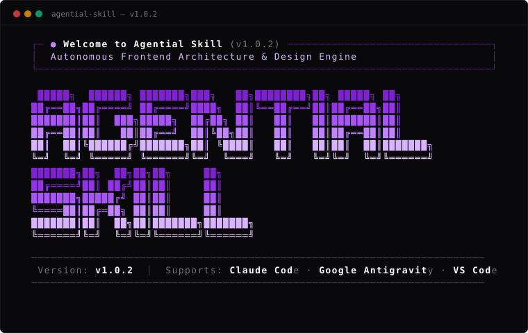

<div align="center">

# Agential Skill

### Autonomous Frontend Architecture & Editorial Design Engine for AI Agents

[](https://www.npmjs.com/package/agential-skill)
[](./LICENSE)
[Live Site](https://agential-skill-webapp.vercel.app/)

<br/>

Specialized for **Claude Code** · **Google Antigravity** · **VS Code (GitHub Copilot)**

<br/>

<p align="center">
  
</p>

</div>

<br/>

## Quickstart

Run one command in the root of your project:

```bash
npx agential-skill init
```

Use **`↑` / `↓` Arrow Keys** to choose your platform, press **`Enter`** to install, and your agent will automatically inherit the standard immediately.

```bash
Choose your AI platform / editor: (Use ↑/↓ arrows, Enter to select, or 1-5)

  ❯ [1] Core Trio (Claude + Antigravity + VS Code) - (Recommended)
    [2] Claude Code (CLAUDE.md)
    [3] Google Antigravity & Gemini CLI (.agents & AGENTS.md)
    [4] VS Code (.github/copilot-instructions.md)
    [5] Export Standalone Prompt for Web LLMs
```

---

## CLI Installation & Usage

### 1. Interactive Setup (Arrow Navigation)
Navigate through options with live keyboard arrows and confirm with `Enter`:
```bash
npx agential-skill init
```

### 2. Automated Install (Zero-Prompt CI/All Platforms)
Installs rules and adapters for Claude Code, Antigravity, VS Code, and Cursor in 1 second:
```bash
npx agential-skill init -y
```

### 3. Framework Presets
Add framework-specific guidelines (component patterns, server/client splits):
```bash
# React 19 & Next.js 15+ App Router
npx agential-skill add react-nextjs

# Vue 3 & Nuxt 3
npx agential-skill add vue-nuxt
```

### 4. Web LLMs (ChatGPT / Claude Web)
Display and copy the standalone single-prompt instructions:
```bash
npx agential-skill prompt
```

---

## CLI Command Reference

| Command | Description |
|:---|:---|
| `npx agential-skill init` | Launch interactive setup wizard with arrow-key navigation |
| `npx agential-skill init -y` | Non-interactive auto-install for all supported agents |
| `npx agential-skill add <preset>` | Add tech stack preset (`react-nextjs`, `vue-nuxt`) |
| `npx agential-skill prompt` | View standalone prompt path for web interfaces |
| `npx agential-skill --help` | View complete CLI flags and options |

---

## Alternative Install Scripts

If you prefer installing directly without `npm`/`npx`:

- **Windows (PowerShell):**
  ```powershell
  irm https://raw.githubusercontent.com/talhairfandev/agential-skill/main/scripts/install.ps1 | iex
  ```
- **macOS / Linux (Bash):**
  ```bash
  curl -fsSL https://raw.githubusercontent.com/talhairfandev/agential-skill/main/scripts/install.sh | bash
  ```

---

## What This Does

AI coding models often generate dated SaaS UI (rounded cards, washed-out blue subtitles, generic templates), break existing code on edits, and forget design guidelines across chat sessions.

Agential Skill fixes this at the root by providing a universal specification (`SKILL.md`) and platform-native rule adapters that enforce:
- **Swiss Architectural Editorial & Brutalist Luxury**: Zero border-radius (`rounded-none`), hairline wireframes (1px dividers), colossal display typography paired with microscopic utility labels, and archival index rows (the Anti-Card Ledger system).
- **Session Memory (`context.md`)**: Automatically updates and reads project state across restarts.
- **Mandatory Post-Edit Verification**: Syntax, import integrity, contrast ratios, and zero regressions checked on every edit.

---

## The Five Pillars

Every AI running this skill follows five rules, in order:

1. **Memory** — Check `context.md` at session start. Persist all design decisions and completed milestones so context survives chat restarts and model switches.

2. **Onboarding** — Before writing new UI, ask 3–4 plain-English questions (theme, primary action, density, pacing). Skip this step when the user already provided specs or is editing existing code.

3. **Design System** — Enforce a strict visual standard: solid high-contrast colors (no rainbow gradients), clean sans-serif typography (Space Grotesk, Plus Jakarta Sans, Inter), minimal border-radius (6–8 px buttons, 8–12 px cards), full-viewport section architecture (100–140 vh desktop, fluid mobile), deliberate motion, WCAG 2.1 AA accessibility compliance (>= 4.5:1 text contrast, visible focus rings), and resilient state UX (forms, skeletons, empty states).

4. **Incremental Delivery** — Build in complete, cohesive chunks (e.g. navbar + hero first). Review the diff, verify, then pause for user feedback before continuing.

5. **Post-Edit Review** — After every file modification, verify imports, closing tags, caller integrity, accessibility attributes, and zero regressions before reporting completion.

---

## Design Specification Standard (`DESIGN.md`)

Agential Skill supports the [Google Labs `DESIGN.md`](https://github.com/google-labs-code/design.md) specification. When installed via `npx agential-skill init`, a canonical `DESIGN.md` token specification file is placed at the project root with machine-readable YAML tokens for color, typography, radii, spacing, and layout.

---

## Supported Platforms

| Platform | File | Loaded via |
|:---|:---|:---|
| **Claude Code** | `CLAUDE.md` | Project instructions |
| **Google Antigravity** | `.agents/skills/agential-skill/SKILL.md` + `AGENTS.md` | Auto-discovery |
| **VS Code (GitHub Copilot)** | `.github/copilot-instructions.md` | Workspace instructions |
| Cursor IDE (Legacy) | `.cursorrules` + `.cursor/rules/agential-skill.mdc` | Always-apply rules |
| Windsurf IDE (Legacy) | `.windsurfrules` | Cascade context |
| Web LLMs (ChatGPT / Claude) | `adapters/system-prompt/prompt.md` | Direct paste |

---

## Framework Presets

| Preset | Stack | Command |
|:---|:---|:---|
| React & Next.js | Next.js 15+, React 19, Server Components | `npx agential-skill add react-nextjs` |
| Vue & Nuxt | Vue 3 Composition API, Nuxt 3 | `npx agential-skill add vue-nuxt` |

---

## Repository Structure

```
agential-skill/
├── SKILL.md                          # Full specification (YAML frontmatter)
├── AGENTS.md                         # Compact enforcement rules (auto-loaded)
├── DESIGN.md                         # Google Labs design token specification
├── README.md
├── LICENSE
├── package.json
├── bin/cli.js                        # Zero-dependency CLI installer
├── context.md                        # Project memory template
│
├── presets/
│   ├── react-nextjs.md
│   └── vue-nuxt.md
│
├── references/
│   ├── accessibility-standards.md    # WCAG 2.1 AA checklist & patterns
│   ├── form-and-feedback-ux.md       # Form validation, skeletons, empty states
│   ├── framer-baseline-rules.md      # Universal Framer-level law for ALL frontend (+ dense-UI standard)
│   ├── framer-design-system.md       # Design system specification
│   ├── framer-portfolio-blueprints.md # Portfolio architecture, modes & signature interactions
│   ├── premium-section-benchmarks.md # Section archetype catalogue
│   ├── questioning-framework.md      # Onboarding question guide
│   ├── context-protocol.md           # Memory persistence protocol
│   ├── post-edit-review-checklist.md # Review checklist
│   └── web-research-workflow.md      # Research trigger rules
│
├── resources/
│   └── design-references/            # Visual reference images (WebP)
│
├── adapters/
│   ├── cursor/.cursorrules
│   ├── copilot/copilot-instructions.md
│   ├── claude/CLAUDE.md
│   ├── windsurf/.windsurfrules
│   └── system-prompt/prompt.md
│
├── assets/
│   └── demo.svg
│
└── .github/workflows/
    └── validate-skill.yml
```

---

## Author

Created by **Talha Irfan** ([@talhairfandev](https://github.com/talhairfandev)).

## License

[MIT](./LICENSE)
